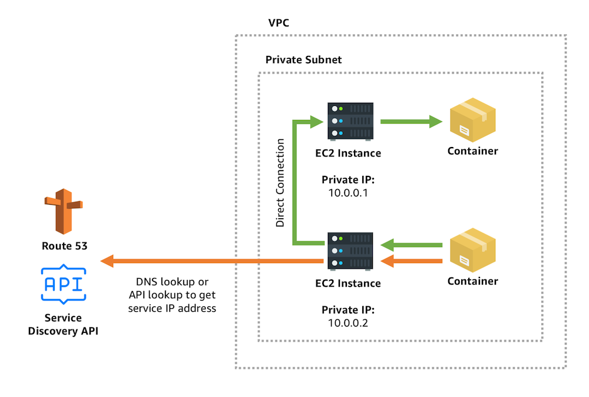
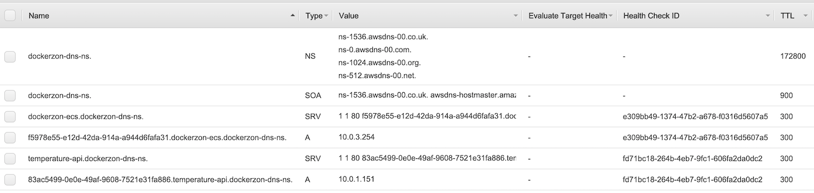

## Service Discovery with ECS



### Why?
By default, ecs services running on different container instances can talk to each other via their private ips. But how does container A know the ip of container B?
This is why Service Discovery comes into play. It allows us to bind a domain to a private ip in the form of DNS records. i.e create a A record that points specified domain to an ip.

### How
It's implemented by creating a set of A/SRV records in a private hosted zone. These records maintain the information of your services.

### Caveats
[Service Discovery Considerations](https://docs.aws.amazon.com/AmazonECS/latest/developerguide/service-discovery.html)

### Service Discovery in dockerzon
[Enable Service Discovery via ecs-cli](https://docs.aws.amazon.com/AmazonECS/latest/developerguide/ecs-cli-tutorial-servicediscovery.html)

### Verification
Go to Route53 and see if you have something setup as follow:



---

### Notes
Code below will get you instance ip:

```shell
# servicediscovery is cloud map cli api name
aws servicediscovery discover-instances \
  --namespace-name=dockerzon-dns-ns \
  --service-name=temperature-api \
  --query 'Instances[0].Attributes.{ip:AWS_INSTANCE_IPV4, port:AWS_INSTANCE_PORT}'
```

will return

```json
{
    "ip": "10.0.1.151",
    "port": "80"
}
```

### References

- [What is SRV why we need one?](https://www.webhostingbuzz.com/wiki/what-srv-record-and-why-you-might-need-one/)
