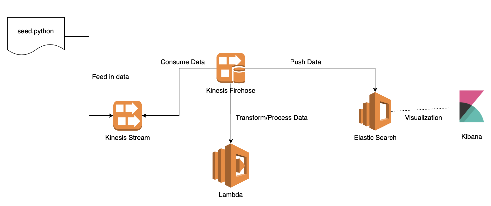

## Pulumi Experiment

This project is bootstrapped by running `pulumi new aws-python`

### Configure to use right profile

```sh
$ AWS_PROFILE=qq pulumi up
```

### Seeding

`seed` directory shows implementations. That is, basically call Kinesis client api to upload data in csv file.

### Processing

`process` folder lives a lambda that is authored to process data from data stream in Kinesis.

### Architecture & workflow

1. Seed data into Kinesis Data Stream
2. Kinesis Firehose consumes data from Kinesis Data Stream
3. Continued with previous step, Kinesis Firehose calls configured lambda to transform/process data it receives
4. Output result will then be fed into ElasticSearch
  4.1 Use Kibana console to visualize searching results based on created filters



### Note

- Kinesis Firehose was manually created during experiment given time constraint

### Reference

[Real time data streaming with python aws kinesis](https://medium.com/swlh/real-time-data-streaming-with-python-aws-kinesis-how-to-part-1-cd56feb6fd0f)
