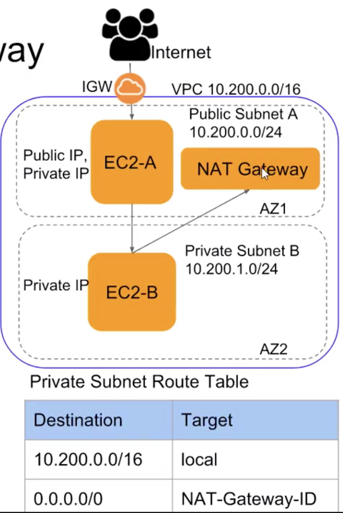

## NAT Gateway

Given time constraint, will not implement it.

### Step-by-step

- Create a `NAT Gateway` in a public subnet.
- Update route table of private subnet to add a route for internet traffic - `0.0.0.0/0` (destination) to point to NAT Gateway (target).

