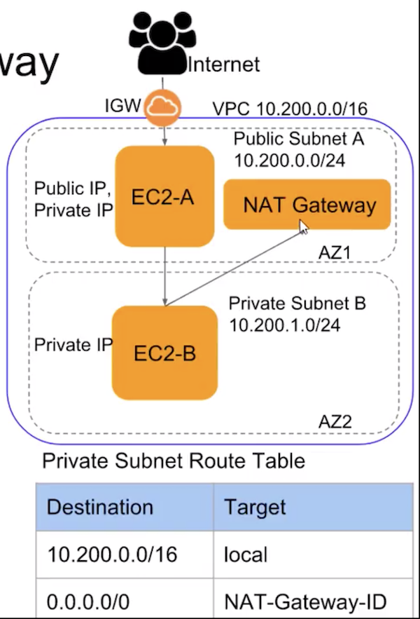

## NAT Gateway

Given time constraint, will not implement it. 

### How it works

The main route table sends internet traffic from the instances in the private subnet to the NAT gateway. The NAT gateway sends the traffic to the internet gateway using the NAT gateway’s Elastic IP address as the source IP address.

### Step-by-step

- Create a `NAT Gateway` in a public subnet.
- Update route table of private subnet to add a route for internet traffic - `0.0.0.0/0` (destination) to point to NAT Gateway (target).

