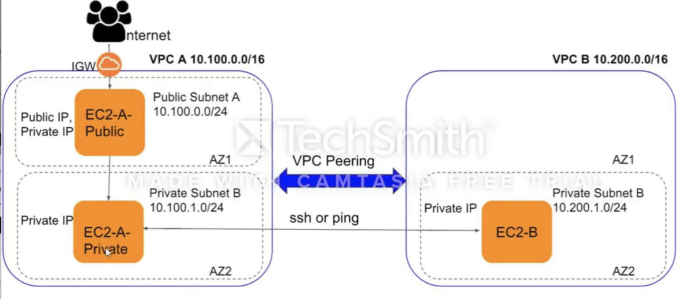

## VPC Peering

### Workflow

- Create 2 VPCs - requester/accepter VPC and subnets
- Create VPC peering conn between 2 subnets from requester/accepter vpc respectively
- Modify route table associated with each subnet to route traffic destined for the other subnet to peering conn id

### Architecture

### Verify

Try to ssh from ec2 in private subnet from requester VPC to the ec2 in private subnet from accepter VPC. If conn is established, peering conn is working.

### Caveats

- SG cannot span across different VPC - ec2 in one VPC cannot use sg from a different VPC

### References

- https://www.middlewareinventory.com/blog/ansible-aws-ec2/
- https://crunchify.com/how-to-create-start-and-configure-amazon-ec2-instance-using-simple-ansible-script-remotely-spawn-vm/

